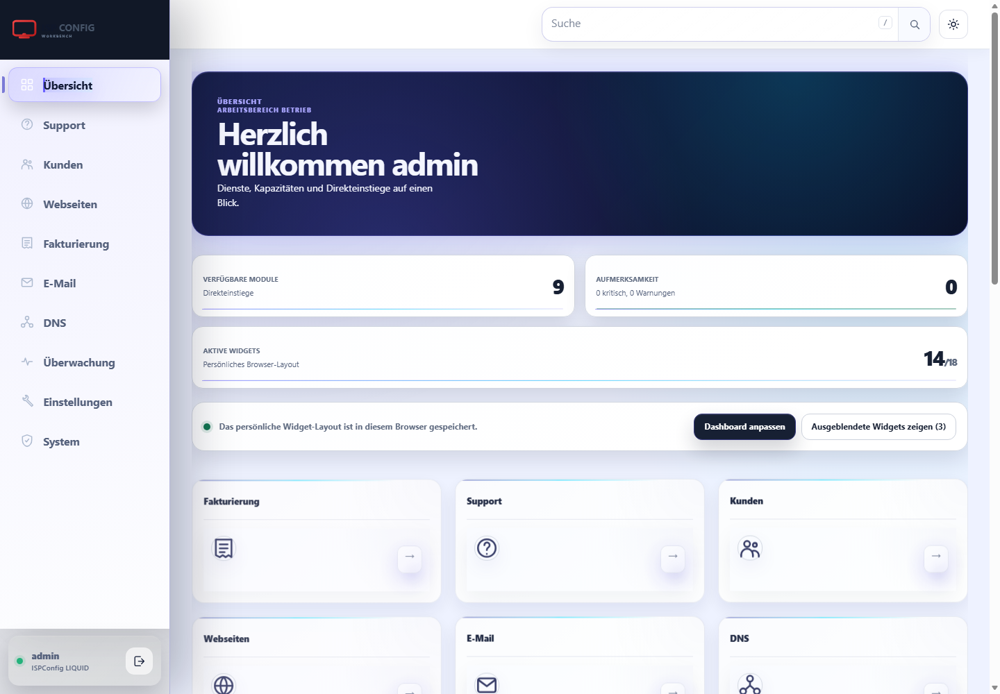

# ISPConfig Theme NEXT

## Deutsch

NEXT ist ein responsives Hell-/Dunkel-Theme für ISPConfig. Es vereinheitlicht
Navigation, Tabellen, Filter, Formulare, Rückmeldungen und responsive Ansichten,
ohne die bewährten Berechtigungen, Routen oder Serveraktionen von ISPConfig zu
ersetzen.

Die Abbildung ist eine echte Laufzeitaufnahme des installierten
stabilen Version `v1.1.4` auf ISPConfig 3.3.1p1. Sie ist kein Konzept-Rendering.

Weitere echte Laufzeitaufnahmen:

- [Login](docs/images/login-runtime-v1.1.4.png)
- [Tabelle mit geöffneten Filtern](docs/images/table-filters-runtime-v1.1.3.png)
- [Formular](docs/images/form-runtime-v1.1.4.png)
- [Mobile Navigation](docs/images/mobile-navigation-runtime-v1.1.4.png)

### Warum NEXT entstanden ist

Die ISPConfig-Oberfläche ist über viele Jahre gewachsen. Dadurch verhalten sich
Navigation, Listen, Filter, Formulare und Statusmeldungen nicht in allen Modulen
gleich. NEXT schafft dafür eine ruhigere und vorhersehbare Bedienoberfläche:
wichtige Aktionen sind schneller auffindbar, Warnungen bleiben von normalen
Akzentfarben unterscheidbar und dieselben Bedienmuster funktionieren auf
Desktop, Tablet und Smartphone.

### Verbesserungen

- Einheitliche visuelle Hierarchie in den unterstützten Modulen
- Kürzere Wege in Navigation und häufigen Aktionen
- Einheitliche Tabellen, Filter, Seitennavigation und Leerzustände
- Klar gruppierte Formulare mit konsistenten Aktionen und Validierungen
- Responsive Darstellung für Desktop, Tablet und Smartphone
- Zurückhaltende Akzentfarben ohne falsche Gefahrensignale
- Helles und dunkles Farbschema mit verbessertem Kontrast
- Konfigurierbares Logo, Favicon und Akzentfarbe
- Eindeutige Lade-, Erfolgs-, Warn- und Fehlerrückmeldungen
- Eigenständiges Theme-Paket ohne Änderung des ISPConfig-Kerns

### Aktueller Status und Kompatibilität

`v1.2.0` ist die vollständig geprüfte stabile Version:

- ISPConfig 3.3.1p1
- PHP 8.1 oder neuer
- Aktuelle Desktop- und Mobilbrowser
- Ubuntu 22.04/24.04 und Debian 12/13 mit Apache und Nginx geprüft

Die vollständige Laufzeitmatrix, Admin-, Reseller-, Kunden- und
Mailuser-Ansichten sowie die visuellen Desktop-, Tablet- und Mobilprüfungen
sind bestanden. Der unveränderliche Tag `v1.2.0` bezeichnet genau diesen
geprüften Quellstand.

### Installation und Projektinformationen

- [Installation auf Deutsch](docs/INSTALLATION-DE.md)
- [Kompatibilität und Prüfbereich](docs/COMPATIBILITY.md)
- [Freigabekriterien für Version 1.2.0](docs/RELEASE-GATE-1.2.0.md)
- [Branding-Anleitung](docs/BRANDING-DE.md)
- [Änderungsprotokoll](CHANGELOG.md)
- [Sicherheitsrichtlinie](SECURITY.md)
- [Mitwirken](CONTRIBUTING.md)

### Lizenz

NEXT ist unter der
[PolyForm Free Trial License 1.0.0](LICENSE.md) source-available. Das Theme darf
weniger als 32 aufeinanderfolgende Kalendertage evaluiert werden.
Produktive Nutzung, fortgesetzte Nutzung nach dem Testzeitraum, Managed Hosting
und andere kommerzielle Nutzung benötigen eine separate kommerzielle Lizenz.
Die Testlizenz erlaubt keine Weiterverteilung.

Von ISPConfig abgeleitete Bestandteile behalten ihre ursprünglichen
BSD-3-Clause-Hinweise in den
[Hinweisen zu Drittbestandteilen](THIRD_PARTY_NOTICES.md). Die praktische
Abgrenzung erläutert die
[Information zur kommerziellen Lizenzierung](COMMERCIAL-LICENSING.md).

ISPConfig und die zugehörigen Marken gehören ihren jeweiligen Inhabern. Dieses
unabhängige Projekt ist weder mit ISPConfig verbunden noch von ISPConfig
offiziell empfohlen.

---

## English

NEXT is a responsive light and dark theme for ISPConfig. It unifies navigation,
tables, filters, forms, feedback and responsive layouts without replacing
ISPConfig's established permissions, routes or server-side operations.

The image is an actual runtime capture of stable version `v1.1.4` on
ISPConfig 3.3.1p1. It is not a concept rendering.

More actual runtime captures:

- [Login](docs/images/login-runtime-v1.1.4.png)
- [Table with expanded filters](docs/images/table-filters-runtime-v1.1.3.png)
- [Form](docs/images/form-runtime-v1.1.4.png)
- [Mobile navigation](docs/images/mobile-navigation-runtime-v1.1.4.png)

### Why NEXT was created

The ISPConfig interface has evolved over many years. As a result, navigation,
lists, filters, forms and status messages do not behave consistently in every
module. NEXT provides a calmer and more predictable workspace: important
actions are easier to find, warnings remain distinct from normal accent colors,
and the same interaction patterns work on desktop, tablet and mobile.

### Improvements

- Consistent visual hierarchy across supported modules
- Shorter paths through navigation and frequent actions
- Unified tables, filters, pagination and empty states
- Clearly grouped forms with consistent actions and validation
- Responsive layouts for desktop, tablet and mobile
- Restrained accent colors that do not imitate danger states
- Light and dark color schemes with improved contrast
- Configurable logo, favicon and accent color
- Clear loading, success, warning and error feedback
- Standalone theme package without ISPConfig core modifications

### Current status and compatibility

`v1.2.0` is the fully validated stable release:

- ISPConfig 3.3.1p1
- PHP 8.1 or newer
- Current desktop and mobile browsers
- Ubuntu 22.04/24.04 and Debian 12/13 with Apache and Nginx validated

The complete runtime matrix, administrator, reseller, customer and mail-user
views, and the visual desktop, tablet and mobile checks have passed. The
immutable `v1.2.0` tag identifies this exact validated source state.

### Installation and project information

- [Installation in English](docs/INSTALLATION-EN.md)
- [Compatibility and validation scope](docs/COMPATIBILITY.md)
- [Version 1.2.0 release gate](docs/RELEASE-GATE-1.2.0.md)
- [Changelog](CHANGELOG.md)
- [Security policy](SECURITY.md)
- [Contributing](CONTRIBUTING.md)

### License

NEXT is source-available under the
[PolyForm Free Trial License 1.0.0](LICENSE.md). The theme may be evaluated for
less than 32 consecutive calendar days. Production use, continued use after
the trial, managed hosting and other commercial use require a separate
commercial license. Redistribution is not permitted by the trial license.

Parts derived from ISPConfig retain their original BSD 3-Clause notices in
[Third-party notices](THIRD_PARTY_NOTICES.md). See
[Commercial licensing](COMMERCIAL-LICENSING.md) for the practical distinction.

ISPConfig and its trademarks belong to their respective owners. This
independent project is not affiliated with or endorsed by ISPConfig.
