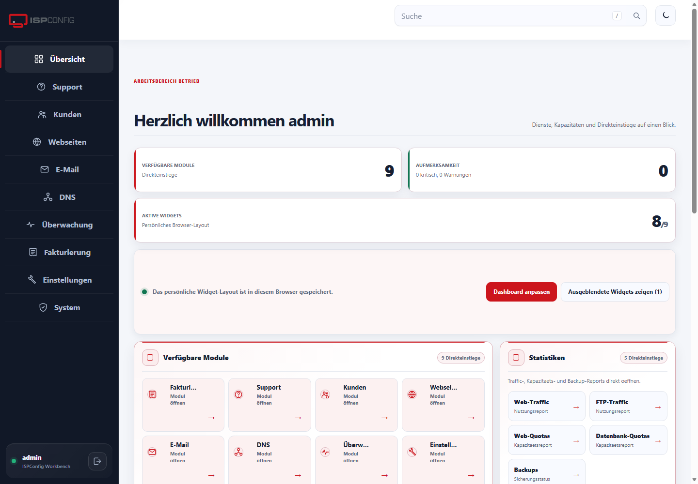

# ISPConfig Theme NEXT

NEXT is a responsive light and dark interface theme for ISPConfig. It focuses on clear navigation, compact data tables, accessible forms, consistent feedback and a polished desktop and mobile experience.

## Why NEXT was created

ISPConfig is a capable administration platform, but its established interface has grown over many years. Different modules do not always present navigation, tables, filters, forms and status messages in the same way. Dense screens, competing visual states and inconsistent responsive behavior can slow down everyday work—especially on smaller displays.

NEXT was created to provide a coherent interface layer without replacing ISPConfig's proven permissions, routes or server-side operations. The goal is not decoration. It is a calmer and more predictable working environment in which important actions are easy to find, warnings remain distinguishable from normal accent styling, and the same interaction patterns work throughout the application.

## What is improved

- A consistent visual hierarchy across modules
- Shorter paths through navigation and common actions
- Tables with unified controls, filters, pagination and empty states
- Forms with clearer grouping, validation and action placement
- Responsive layouts designed for desktop, tablet and mobile
- A restrained accent system that does not make normal actions look dangerous
- Accessible light and dark color schemes with improved contrast
- Configurable logo, favicon and accent color
- Clearer loading, success, warning and error feedback
- A modular theme package that leaves ISPConfig core behavior intact

## Highlights

- Light and dark color schemes
- Responsive navigation and content layouts
- Consistent tables, filters, forms and dialogs
- Configurable branding and accent color
- Modern dashboard components
- German and English interface support
- Installable without changing ISPConfig core files

## Compatibility

- ISPConfig 3.3 development line
- PHP 8.1 or newer
- Current desktop and mobile browsers

Test the theme on a staging system before using it in production.

## Installation

- [Deutsch](docs/INSTALLATION-DE.md)
- [English](docs/INSTALLATION-EN.md)

## Project information

- [Changelog](CHANGELOG.md)
- [Compatibility and validation](docs/COMPATIBILITY.md)
- [Branding guide](docs/BRANDING-DE.md)
- [Release process](docs/RELEASE-PROCESS.md)
- [Security policy](SECURITY.md)
- [Contributing](CONTRIBUTING.md)

## Licensing

NEXT is source-available under the [PolyForm Free Trial License 1.0.0](LICENSE.md). It may be evaluated for less than 32 consecutive calendar days. Production use, continued use after the trial, managed hosting and other commercial use require a separate commercial license. Redistribution is not permitted by the trial license.

Parts derived from ISPConfig retain their original BSD 3-Clause notices in [THIRD_PARTY_NOTICES.md](THIRD_PARTY_NOTICES.md). See [commercial licensing](COMMERCIAL-LICENSING.md) for the practical distinction.

ISPConfig and its trademarks belong to their respective owners. This independent project is not affiliated with or endorsed by ISPConfig.
